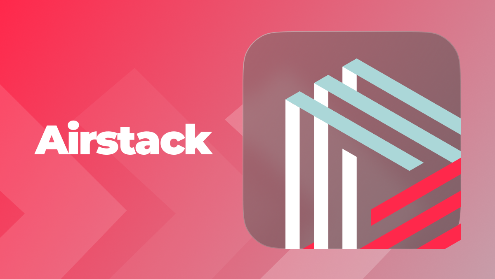
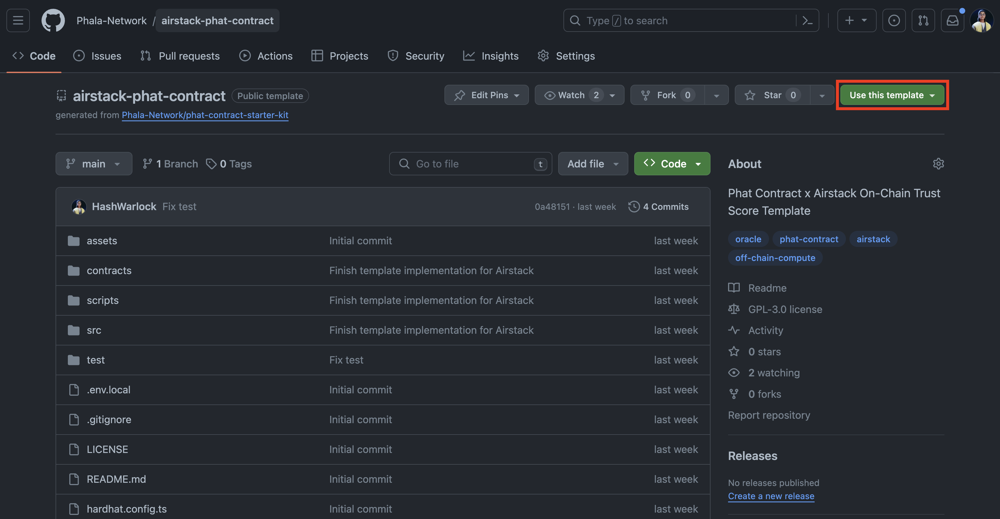
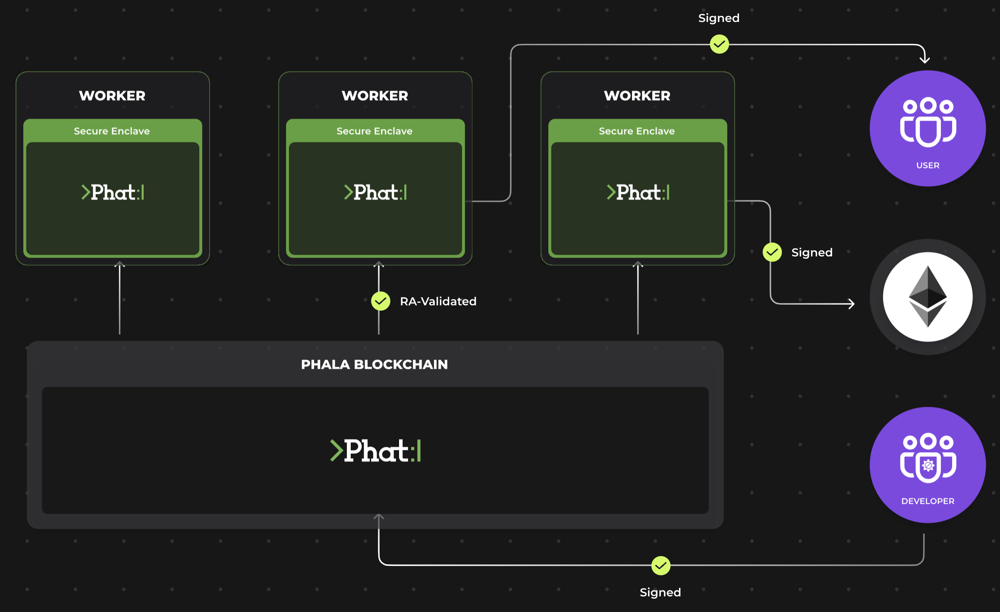
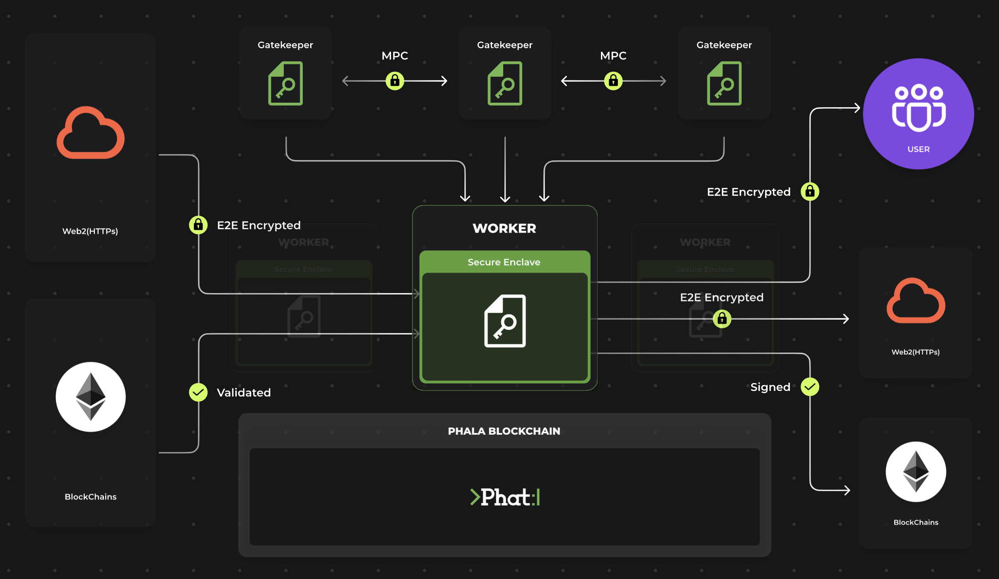

# The Airstack Starter Kit

## :mag_right: Overview
The [Airstack](https://www.airstack.xyz/) Starter Kit is your one-stop solution to connect Airstack's API to your smart contract. It offers wide-ranging support for all EVM-compatible blockchains, including but not limited to Ethereum, Polygon, Arbitrum, Avalanche, Binance Smart Chain, Optimism, and zkSync.


This starter kit empowers you to initiate the data request from the smart contract side to retrieve information from Airstack's API. The request is then seamlessly sent to your script for processing. You have the liberty to call any APIs to fulfill the request and define the response data structure that will be replied to your smart contract.
## :runner: Quick Start
To kickstart your journey with the Phat Contract Starter Kit, you have 2 options:
1. Create a template from the [`airstack-starter-kit`](https://github.com/Phala-Network/airstack-phat-contract) template repo. Click on the "**Use this template**" button in the top right corner of the webpage. Then skip the `npx @phala/fn@latest init example` step.
  
2. Install the `@phala/fn` CLI tool. You can do this using your node package manager (`npm`) or use node package execute (`npx`). For the purpose of this tutorial, we will be using `npx`.

(Option 2) Once you have the CLI tool installed, you can create your first Phala Oracle template with the following command.
```bash
# Skip this step if chose option 1 or cloned this repo
npx @phala/fn@latest init example
```

<center>:rotating_light: <u><b>Note</b></u> :rotating_light:</center> 

> When selecting your template, elect `airstack-phat-contract`.

```shell
npx @phala/fn@latest init example
? Please select one of the templates for your "example" project: (Use arrow keys)
  phat-contract-starter-kit. The Phat Contract Starter Kit 
  lensapi-oracle-consumer-contract. Polygon Consumer Contract for LensAPI Oracle
❯ airstack-phat-contract. The Airstack Starter Kit. 
```

:stop_sign: **Not so fast!** What is it exactly that we are building? :stop_sign:

> **What are we building?** 
>
> The artifact we are compiling is a JavaScript file, serving as the Phat Contract Oracle's tailored logic. This script is designed to respond to requests initiated from the Consumer Contract. The diagram provided above offers a visual representation of this request-response interaction.
> 
> **Why is it important?**
>
> In the context of the off-chain environment, on-chain Smart Contracts are inherently limited. Their functionality is confined to the information available to them within the on-chain ecosystem. This limitation underscores the critical need for a secure off-chain oracle, such as the Phat Contract. This oracle is capable of fetching and transforming data, thereby enhancing the intelligence and awareness of Smart Contracts about on-chain activities. This is a pivotal step towards bridging the gap between the on-chain and off-chain worlds, making Smart Contracts not just smart, but also informed.
>

After creating the Airstack Phat Contract template, `cd` into the new project and install the package dependencies. You can do this with the following command:
```bash
npm install
```
Now, build the default Phat Contract function with this command:
```bash
npm run build-function
```
To simulate the expected result locally, run the Phala Oracle function now with this command:
```bash
npm run run-function -- -a 0x0000000000000000000000000000000000000000000000000000000000000005000000000000000000000000eaf55242a90bb3289db8184772b0b98562053559000000000000000000000000624fef3390a244a834f19b3dbfddc28939530c170000000000000000000000000000000000000000000000000000000000000080000000000000000000000000000000000000000000000000000000000000000500000000000000000000000000000000000000000000000000000000000000010000000000000000000000000000000000000000000000000000000000000002000000000000000000000000000000000000000000000000000000000000000100000000000000000000000000000000000000000000000000000000000000020000000000000000000000000000000000000000000000000000000000000001 '{"apiUrl": "https://api.airstack.xyz/gql", "apiKey": "3a41775a358a4cb99ca9a29c1f6fc486"}'
```

Finally, run the local end-to-end tests with this command. Here we will simulate locally the interaction between the Phat Contract and the Consumer Contract with hardhat.
```bash
npm run localhost-test 
```
:partying_face: **Congratulations!** 

You have successfully completed the quick start. For the next steps, you will learn how to deploy your Phala Oracle and connect to the consumer contract for the EVM testnet chain to start testing the request-response model live.

For a deeper dive into the details, click [here](https://bit.ly/connect-pc-2-0-to-evm-sc),  or continue reading to learn about the valuable features the Phala Oracle can offer to your on-chain consumer contract.

---
## :magic_wand: Features and Benefits

- Wide support for all mainstream blockchains
- **Verifiable and decentralized**: every Oracle is running on decentralized infrastructure that require no operations and can be easily verified

- **Support private data**: your Oracle state is protected by cryptography and hardware

- **No extra cost**: the only cost is the gas fee of response data which is sent as a transaction
- **High frequency**: the request is synced to Oracle within one minute, and the latency of response is only limited by blockchain’s block interval

## :building_construction: Use cases & Examples

You could use the Oracle to:
- **[Create a Telegram / Discord trading bot with Phat Contract](https://bit.ly/3LGpXCq)**
- **[Cross-chain DEX Aggregator](./assets/case-cross-chain-dex-aggregator.jpg)**
- **[Bring Web2 services & data on-chain](./assets/case-contract-controlled-web2-service.jpg)**
- **Web3 Social Integrations**
  - **[LensAPI Oracle](https://bit.ly/3runoN1)**
  - **[Lens Phite](https://bit.ly/3RG9OR7)**
  - **[Mint NFT based on LensAPI Oracle data](./assets/LensAPI-Oracle.png)**
  - **[Lens Treasure Hunt](https://bit.ly/3PWP5Y9)**
- **[Get Randomness on-chain from drand.love and post with Telegram bot](https://bit.ly/3PXDyI4)**
- **Trustless HTTPS requests w/ [TLSNotary](https://bit.ly/3rwD2Hw) integration**
- **[Connect to Phat Contract Rust SDK](./assets/Oracle-Rust-SDK.png)** to access all features
- **[Dynamic NFTs](https://bit.ly/3ZBJHNb)**

## :books: Resources
- **[Airstack Docs](https://docs.airstack.xyz/airstack-docs-and-faqs/)**
- **[What is an Oracle](https://bit.ly/3PE6ymF)**
- **[`phat_js` Docs](https://bit.ly/phat_js)**
- **Frontend Templates**
  - **[Scaffold ETH2](https://bit.ly/45ekZnt)**
    - **[Phat Scaffold ETH2](https://github.com/HashWarlock/airstack-phat-contract)**
  - **[Create ETH App](https://bit.ly/468I105)**
  - **[Nexth Starter Kit](https://bit.ly/3EVS0di)**
- **[Technical Design Doc](https://bit.ly/3ZAzdxE)**
